# Calendar path concepts

## Scope and references

**Implementation update:** These concept images now have a working calendar at `/calendar`. See [calendar-page.md](calendar-page.md) for the implemented behavior and verification. The scope and example dates below describe the original visual-concept stage.

A complete 2026 collection of twelve visual concepts for the Ladybugs calendar page. The user approved the initial February, June, October, and December concepts and requested pages for every month. Scope remains **visual concepts only**. They extend the approved [group carousel](concepts/group-selection-v4-carousel.png), [students page](concepts/students-page-v2.png), and [product concept](kindergarten-attendance-concept.md). Images are generated with the built-in `image_gen` tool; this document does not describe completed application changes. The original four concepts' exact generation and refinement prompts are saved in [calendar-concept-image-prompts.md](calendar-concept-image-prompts.md); the eight additional months' prompts are in [calendar-year-image-prompts.md](calendar-year-image-prompts.md).

The twelve final monthly PNGs are in [concepts/](concepts/), named `calendar-<month>-v1.png`. January's correction prompt is saved separately in [calendar-january-v2-image-prompt.md](calendar-january-v2-image-prompt.md).

Retain watercolor paper, a warm ivory center, soft peach framing, rounded dark-brown lettering, cheerful meadow borders, and the familiar red-and-black ladybug. Seasonal scenery stays at the edges so date numbers remain prominent. A compact header contains **Back to group**, **Our little days**, previous/next month controls, the month and year, and **Today**.

## Shared calendar behavior

- A single winding path visits every date in chronological order, like an advent trail. Five sweeps run **1–6 left-to-right**, **7–12 right-to-left**, **13–18 left-to-right**, **19–24 right-to-left**, and **25–last left-to-right**, with clear turns and generous spacing. There is no weekday grid, blank padding date, dimmed or locked future date, or reward progression.
- Each numbered stop is a flower or seasonal object with a quiet, high-contrast number center. Show every integer exactly once, from **1** through the month's actual final date. Keep the trail visible between all adjacent stops, including row turns.
- One ladybug mascot stands beside today's stop, accompanied by a small **Today** label. It never covers the number. In a future implementation, a thin, contrasting outline marks a selected date independently; this selection state need not appear in the concept images. Selecting another date does not relocate the today mascot. When browsing a different month, **Today** returns to the real current month; do not imply today exists within every viewed month.
- A small cake-and-balloon badge marks birthdays consistently across all twelve themes. It sits outside the date number, remains distinct from holiday ornaments, and can coexist with today, selection, and holiday styling. Multiple birthdays use one badge with a count; accessible details name the relevant students only when real student data is available.
- Date activation opens the group's day page for that date. Dates remain available for viewing or recording attendance regardless of their position on the trail. Holidays do not disable dates.

**Concept data:** birthdays on days **8** and **22** are fictional visual examples, unrelated to any student roster. No child names are shown. The illustrated current day is **12** in every proposed image; this is a simulated state for comparison, not a claim about the actual current date.

## Twelve monthly directions

All months are **2026**. All twelve concepts have passed visual review. The original four are also user approved; the eight additional concepts are ready for user review.

| Month | Dates | Day motifs and seasonal setting | Image | Review |
| --- | --- | --- | --- | --- |
| January | **1–31** | Snowflakes and snowdrops with pale evergreen sprigs and a soft winter border. | [January](concepts/calendar-january-v2.png) | Verified |
| February | **1–28** | Heart-shaped blossoms in blush, berry, and sage; a fuller flower wreath marks Valentine's Day on **14**. | [February](concepts/calendar-valentines-v1.png) | Verified; user approved |
| March | **1–31** | Crocus blossoms, fresh green shoots, and small early-spring flowers. | [March](concepts/calendar-march-v1.png) | Verified |
| April | **1–30** | Tulips, gentle raindrop details, and budding leaves. | [April](concepts/calendar-april-v1.png) | Verified |
| May | **1–31** | Peonies and daisies with soft, abundant spring foliage. | [May](concepts/calendar-may-v1.png) | Verified |
| June | **1–30** | Daisies, buttercups, and soft coral flowers along a meadow path with sage leaves and summer grass. | [June — original generic concept](concepts/calendar-generic-v1.png) | Verified; user approved |
| July | **1–31** | Sunflowers and bright summer blooms with lush meadow greenery. | [July](concepts/calendar-july-v1.png) | Verified |
| August | **1–31** | Poppies, golden blooms, and warm late-summer grasses. | [August](concepts/calendar-august-v1.png) | Verified |
| September | **1–30** | Apples and asters with the first amber leaves. | [September](concepts/calendar-september-v1.png) | Verified |
| October | **1–31** | Rounded pumpkins and amber leaves in muted orange, plum, and cream; a smiling pumpkin and friendly ghost mark Halloween on **31**. | [October](concepts/calendar-halloween-v2.png) | Verified; user approved |
| November | **1–30** | Acorns, autumn leaves, and little mushrooms in soft russet woodland scenery. | [November](concepts/calendar-november-v1.png) | Verified |
| December | **1–31** | Baubles and evergreen wreaths in cranberry, pine, snow blue, and cream; a festive tree marks Christmas on **25**, with the trail continuing through **26–31**. | [December](concepts/calendar-christmas-v2.png) | Verified; user approved |

Use the same composition and birthday icon in every variant so differences are seasonal. Holiday nodes may be more decorative but must preserve date-number size, hit area, and path continuity. A compact legend explains **Today** and **Birthday** without duplicating the mascot; add **Selected** when that state is implemented.

These are Northern Hemisphere seasonal illustrations. The eight additional months introduce no new holiday rules and do not assume that a holiday means the kindergarten is closed. Valentine's imagery remains a friendly kindergarten friendship celebration; Halloween uses cheerful faces. December is a full-month calendar, not a 24-day advent countdown.

## Future responsive and accessible implementation

On desktop, fit the trail inside one generous shared panel. On narrow screens, reduce the number of stops per curve and allow vertical scrolling; preserve chronological reading order and legible numbers instead of shrinking the entire illustration. Keep the month controls visible and offer a clear **Today** action. Provide at least 44 × 44 CSS-pixel date targets, spacing between badges and adjacent targets, and visible keyboard focus.

Implement dates as an ordered sequence of real controls with accessible full-date names. Include today, selection, holiday, and birthday information in those names or associated descriptions; do not depend on color, position, or hover. Keep decorative path artwork and the mascot out of the accessibility tree. Keyboard navigation follows chronological order even when a drawn row reverses direction. A plain chronological list view can provide an alternative when the illustrated route is difficult to use. Honor reduced-motion preferences; no mascot movement is necessary to understand the calendar.

Attendance remains attached to a **student, group, and date**. **Unmarked**, **present**, and **absent** remain distinct. A past stop, an empty date, or a birthday never implies absence or a completed attendance record. Do not introduce attendance totals without a defined reporting period.

## Visual review

The original four PNGs are 1536 × 1024 pixels and have been visually checked: June has 30 dates, February 28, and October and December 31, each appearing once in chronological trail order. All four show the mascot beside day 12 and readable birthday markers on days 8 and 22. Holiday accents appear on February 14, October 31, and December 25. Halloween and Christmas version 2 correct a reversed trail arrow and remove extra slogan signs. December continues past Christmas through day 31.

All eight additional concepts have passed visual review: January, March, May, July, and August each have 31 dates; April, September, and November each have 30. Checks cover chronological date order, the final date, mascot placement at 12, and readable birthday badges at 8 and 22. These new concepts have been verified for visual correctness; they have not yet received the user approval recorded for the original four.

January version 2 corrects snow obscuring the fourth trail sweep and a duplicated birthday marker in version 1. All **1–31** date numbers are now unobscured, the serpentine arrows follow chronological order, and days **8** and **22** each have one clear birthday badge. The ladybug remains beside **12**, wearing a blue scarf without a Santa hat. All twelve final monthly concepts are ready for review.

## Concept gallery

### January — winter snowdrops

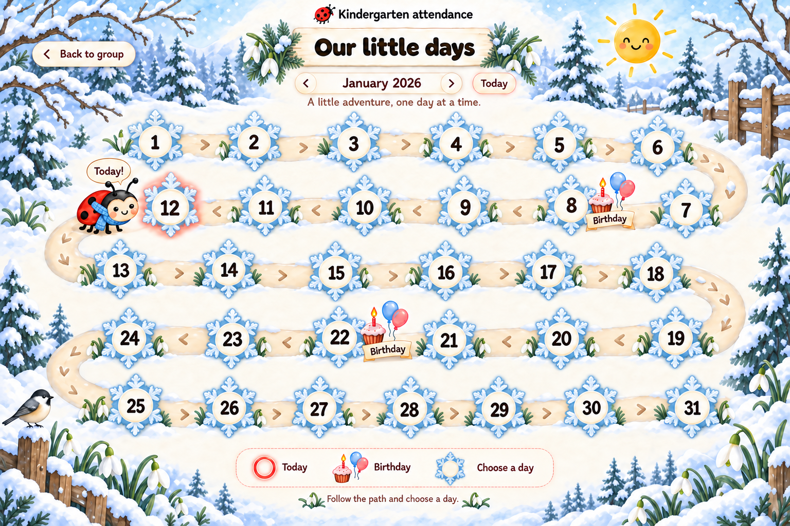

### February — Valentine's Day

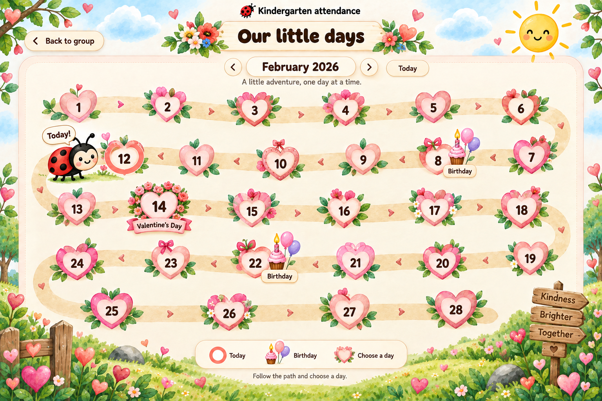

### March — crocus blossoms

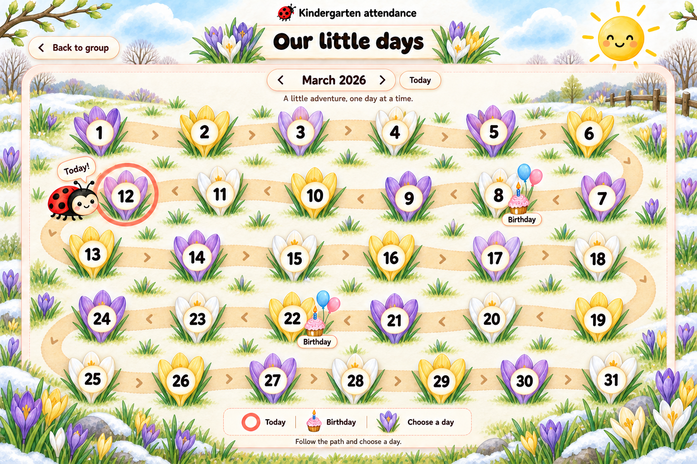

### April — tulips

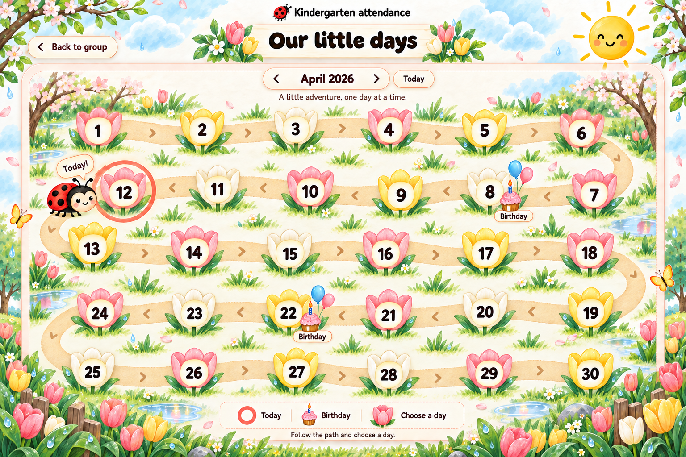

### May — peonies and daisies

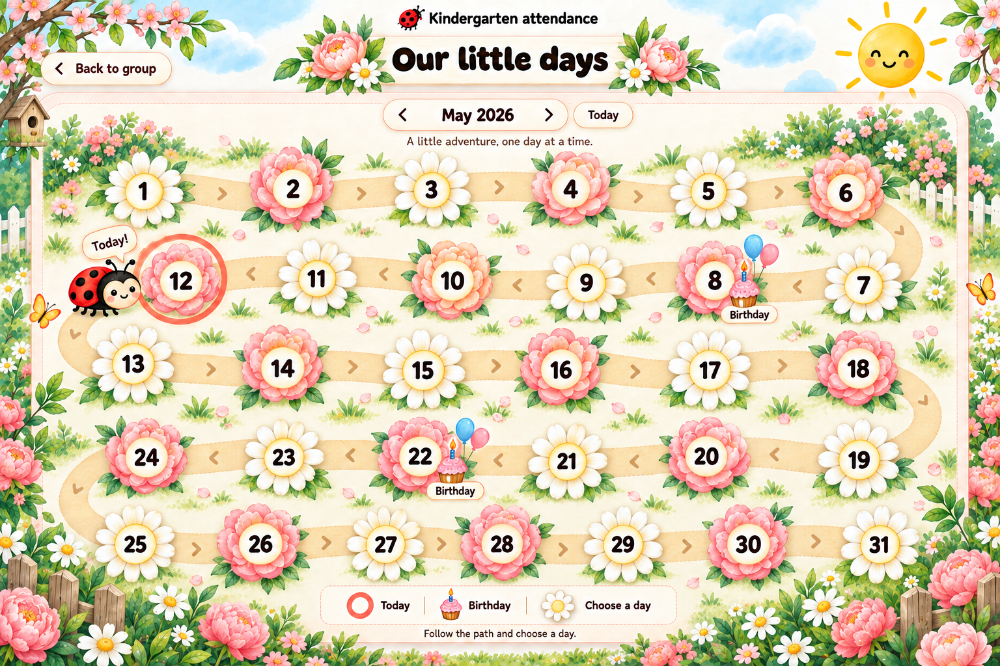

### June — summer meadow

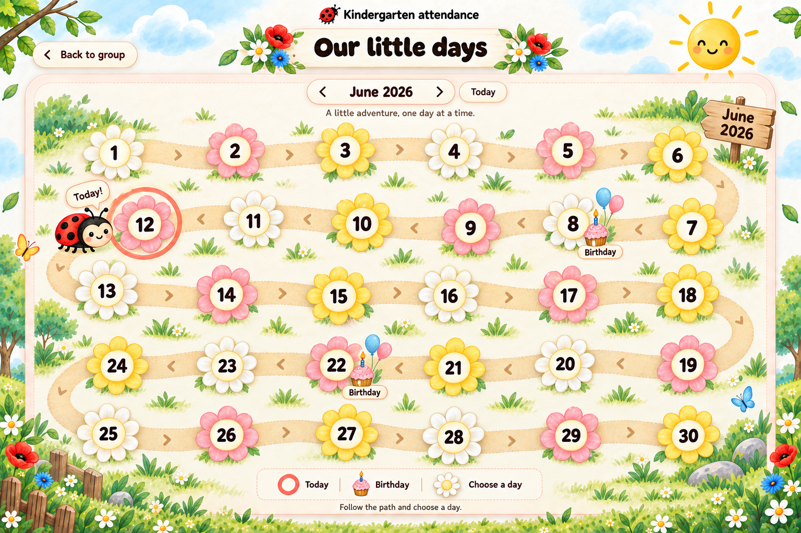

### July — sunflowers

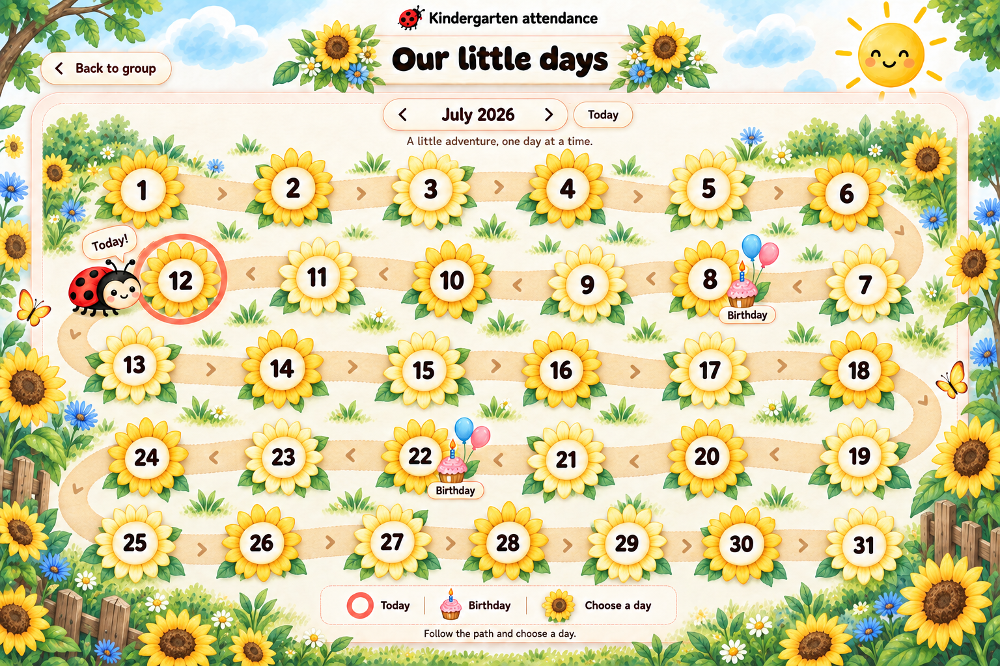

### August — poppies and golden blooms

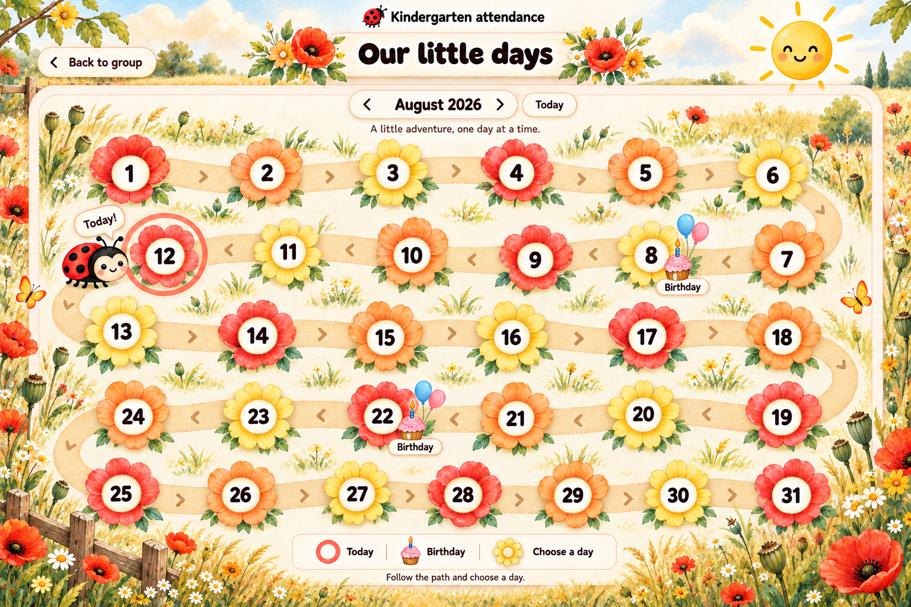

### September — apples and asters

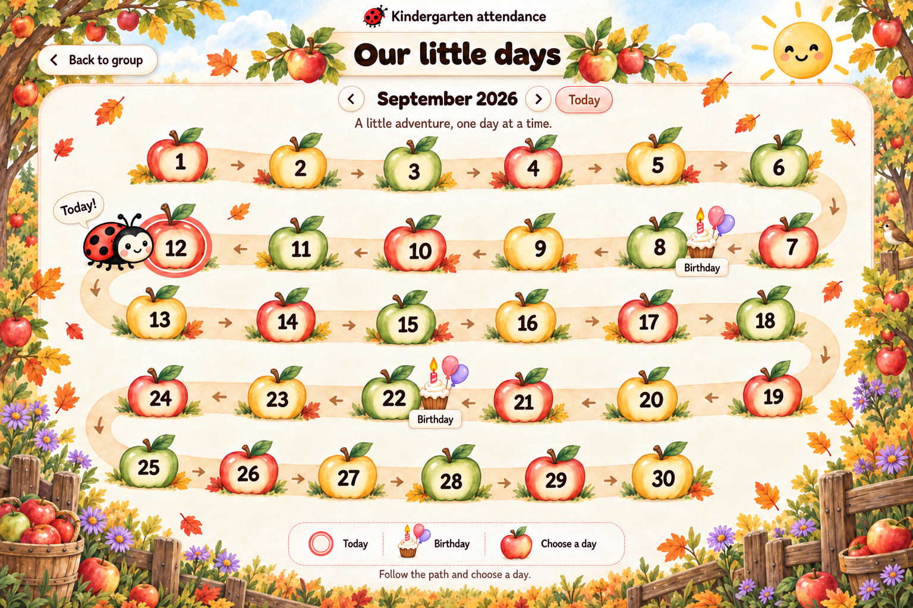

### October — Halloween

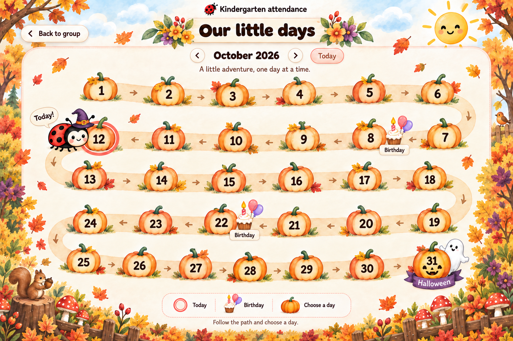

### November — autumn woodland

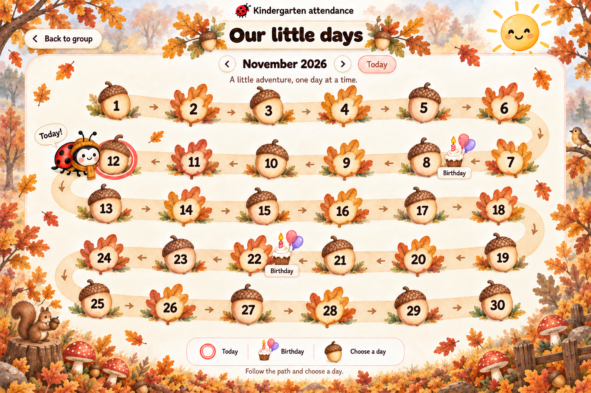

### December — Christmas

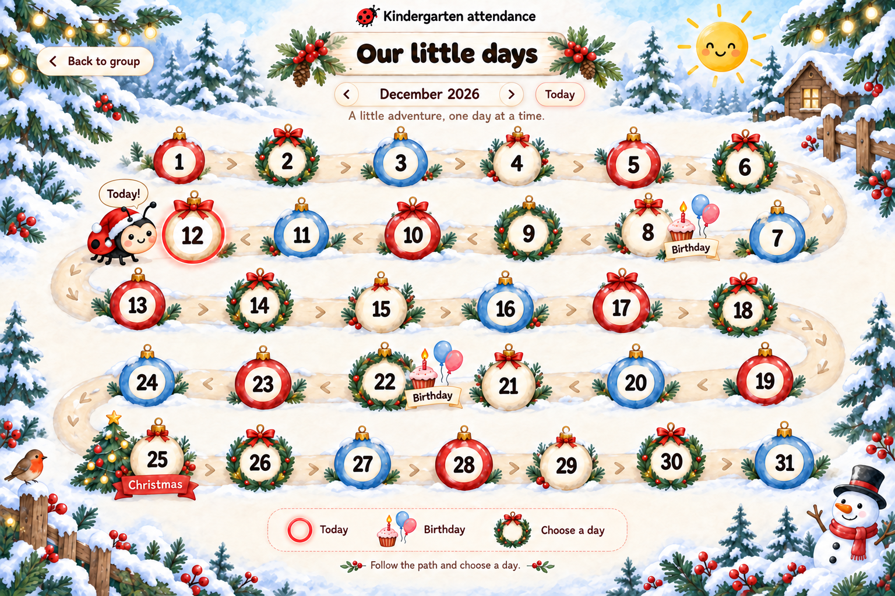
