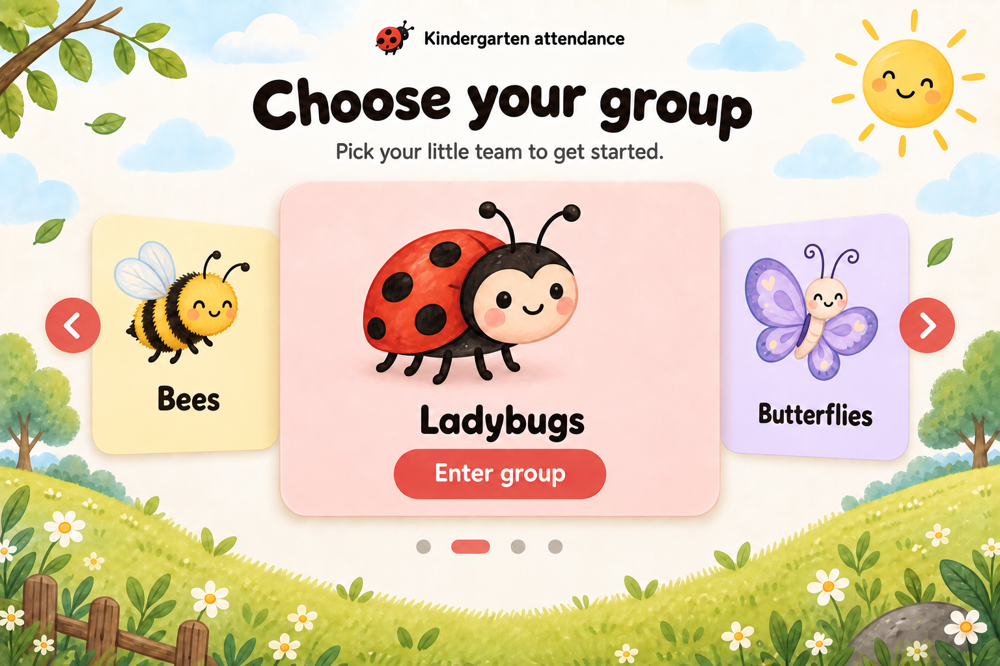

# Kindergarten attendance app concept

## Purpose and current scope

Build a React app for recording kindergarten student attendance. Groups have animal or insect names, and each group's identity carries through its pages.

**Confirmed current scope:** Support multiple animal or insect groups. The user approved the layout and visual style of carousel version 4, with Ladybugs as the featured example and mascot-only card illustrations. Earlier concepts remain saved as historical alternatives.

The first step is an image concept for the **group selection page**: cartoonish, very child friendly, and animal themed. Use this concept to refine the design before implementing the app. No React implementation is part of this first step.

## Planned pages

| Page or component | Purpose | Group-specific content |
| --- | --- | --- |
| 1. Group selection | Choose the kindergarten group to work with. | Animal or insect name, illustration, and theme for each group. |
| 2. Welcome page | Introduce the selected group and provide the next action. | Group name, mascot, colors, and whether students have been added. |
| 3. Add students page | Add students when the selected group has no students. | Students belong to the selected group. |
| 4. Calendar | Choose a date for viewing or recording attendance. | Selected group's theme and attendance context. |
| 5. Day page | Show the selected group's student list for a chosen date and record attendance. | Group, date, student list, and each student's attendance state. |
| 6. Student info modal | Show a student's presence and absence counts. | Selected student and selected group; the reporting period still needs definition. |

## First-page design direction

The layout and visual style of carousel version 4 are the approved direction. Ladybugs is the featured group; additional group names, interface language, and wording remain provisional.

**Confirmed card-art constraint:** Inside each group card, show only its animal or insect mascot on a soft, plain pastel background. Include no flowers, leaves, grass, plants, or habitat scenery inside the cards. Keep the group names and functional **Enter group** button. Meadow decoration outside the cards stays.

- **Title:** “Choose your group”
- **Supporting copy:** “Pick your little team to get started.”
- **Featured group:** Ladybugs. Bees, Butterflies, and Bunnies are provisional examples for the carousel.
- **Historical single-card alternative:** One large, centered, rounded, clickable card for Ladybugs, saved as version 2.
- **Illustration:** A friendly storybook ladybug with an expressive face and soft, rounded shapes as the card's clear mascot.
- **Setting:** A calm meadow with gentle grass, flower, cloud, and sunshine details outside the cards. Keep the background quiet enough for the card and its label to remain easy to read.
- **Palette:** Ladybug red, soft blush, warm cream, and meadow green.
- **Typography:** Large, readable, rounded lettering; short labels with clear contrast.
- **Interaction:** Identify each group with both text and its illustration. Provide clear hover and keyboard-focus states for the carousel controls and **Enter group** action.
- **Language:** English for this initial concept; final interface language is undecided.

The selection page should feel playful and welcoming while making the next action immediately clear. Do not put invented student records or attendance statistics in the concept.

## Approved carousel direction

Use carousel version 4 as the visual direction for multiple groups, retaining its title, supporting copy, storybook style, and meadow setting. The interaction details below guide a later implementation.

- **Composition:** One large active Ladybugs card in the center, with smaller Bees and Butterflies previews on either side to suggest more groups. On narrow screens, let neighboring cards peek into the viewport. Bunnies is offscreen in this example.
- **Browsing:** Place previous and next controls outside the cards and pagination indicators below the carousel. Use group names and distinct mascots alongside each group's accent colors.
- **Entering a group:** Provide an explicit **Enter group** primary action for the active card. Browsing between cards changes the active group without opening its welcome page.
- **Touch and keyboard:** Support swiping on touch screens and keyboard navigation, with clearly visible focus states and accessible control labels.
- **Motion:** Do not autoplay. Respect reduced-motion preferences when changing cards.
- **One-group case:** Hide carousel navigation controls and pagination when only one group is available.

## Proposed navigation

1. Browse to a group card in the carousel and use **Enter group** to open that group's welcome page.
2. If the group has no students, the welcome page's primary action is **Add students**. Otherwise, it is **Open calendar**.
3. After adding students, continue to the selected group's calendar.
4. Choose a calendar date to open the day page for that group and date.
5. Open a student's info action to view the presence and absence count modal.

Keep the selected group's name, mascot, and accent colors consistent across the welcome page, student entry, calendar, day page, and modal. Reuse the same layout and controls for each group, with Ladybugs as the featured theme in the current concepts.

## Attendance behavior to preserve

- Attendance belongs to a student, group, and date.
- **Unmarked** is a separate state from **absent**. A missing attendance entry must not automatically count as an absence.
- Presence and absence totals should reflect recorded attendance within an explicitly defined reporting period.

## Decisions for later

These are open design details, not additional requirements for the first concept:

- Final interface language and refinements to the Ladybugs mascot.
- Final names and mascots for the additional animal or insect groups.
- Calendar date range and the reporting period used in student totals.
- How staff edit student details or correct attendance entries.
- Whether any other attendance states are needed beyond present, absent, and unmarked.

## Reusable background asset

The approved carousel's meadow is saved separately as an opaque 1536 × 1024 PNG: [group-selection-meadow.png](../public/assets/backgrounds/group-selection-meadow.png). It retains the sunny meadow border and a large, quiet cream center for page content. Visually checked that all text, cards, mascots, and controls are removed.

The background is derived through a built-in image generation edit of version 4, removing all interface elements and mascots and reconstructing the areas they covered. The edit prompt is saved in [meadow-background-image-prompt.md](meadow-background-image-prompt.md).

## First-page concept images

### Carousel variant — current revision

Saved image: [concepts/group-selection-v4-carousel.png](concepts/group-selection-v4-carousel.png), 1536 × 1024 pixels.

The exact edit prompt is saved in [group-selection-carousel-v4-image-prompt.md](group-selection-carousel-v4-image-prompt.md). Created with the built-in image generation tool using version 3 as the edit target. Visually checked that all three card illustrations contain only their insect mascots, with flowers and plants removed; group names, the Enter group button, carousel controls, and the meadow outside the cards remain.

### Earlier alternatives

- [Carousel with plants inside the cards, version 3](concepts/group-selection-v3-carousel.png), with its [prompt](group-selection-carousel-image-prompt.md).
- [Single Ladybugs card, version 2](concepts/group-selection-v2.png), with its [edit prompt](group-selection-v2-image-prompt.md).
- [Four-group grid, version 1](concepts/group-selection-v1.png), with its [generation prompt](group-selection-image-prompt.md).

Earlier variants remain available for reference; carousel version 4 is the approved direction.
